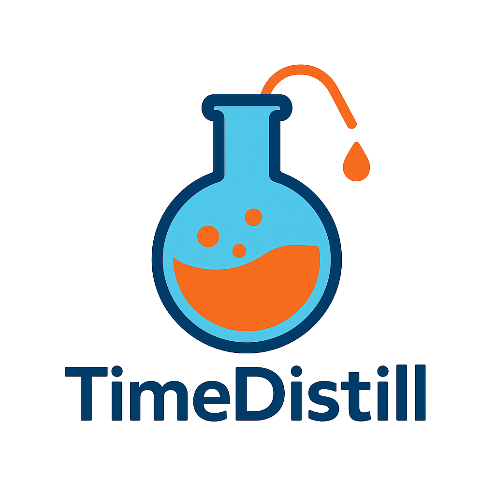
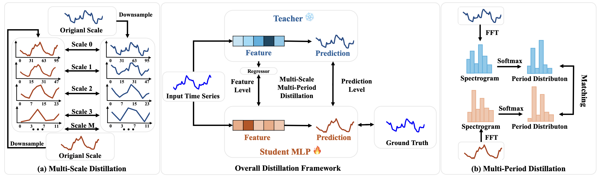

<div align="center">
  <!-- <h1><b> TimeDistill </b></h1> -->
  <!-- <h2><b> TimeDistill </b></h2> -->
  <h2><b> TimeDistill: Efficient Long-Term Time Series Forecasting with MLPs via Cross-Architecture Distillation </b></h2>
</div>

<!-- <div align="center">


</div> -->

<div align="center">

**[<a href="https://arxiv.org/abs/2502.15016">Paper Page</a>]**


**[<a href="https://mp.weixin.qq.com/s/qsZ6HCQfUb-9UFIEpyRBFg">新智元中文解读</a>]**
**[<a href="https://mp.weixin.qq.com/s/B_pAcRC5U2SK5dI4MP2SaQ">时序人中文解读</a>]**
**[<a href="https://mp.weixin.qq.com/s/v4OpI2B943uMgv7v4javJQ">时空探索之旅中文解读</a>]**

</div>

<p align="center">

</p>

---
>
> 🧑‍💻 Please let us know if you notice any mistakes or have suggestions!
>
> 🌟 If you find this resource helpful, please consider starring this repository and citing our research:
```
@article{ni2025timedistill,
  title={TimeDistill: Efficient Long-Term Time Series Forecasting with MLP via Cross-Architecture Distillation},
  author={Ni, Juntong and Liu, Zewen and Wang, Shiyu and Jin, Ming and Jin, Wei},
  journal={arXiv preprint arXiv:2502.15016},
  year={2025}
}
```
## Introduction
Transformer and CNN models perform well in long-term time series forecasting but are resource-intensive. TimeDistill, a knowledge distillation framework that transfers temporal and frequency patterns from these models to lightweight MLPs. It improves MLP performance by up to 18.6%, surpasses teacher models on eight datasets, runs up to 7× faster, and uses 130× fewer parameters.
<p align="center">

</p>
TimeDistill is consist of two modules: (a) Multi-Scale Distillation involves downsampling the original time series into multiple coarser scales and aligning these scales between the student and teacher. (b) Multi-Period Distillation applies FFT to transform the time series into a spectrogram, followed by matching the period distributions after applying softmax.

## Usage
1. **Install requirements.** ```pip install -r requirements.txt``` or ```conda env create -f environment.yml```
2. **Download data.** You can download the all datasets from [Google Driver](https://drive.google.com/u/0/uc?id=1NF7VEefXCmXuWNbnNe858WvQAkJ_7wuP&export=download) and put ``.zip`` file in ```./dataset/``` and unzip directly. All the datasets are well pre-processed and can be used easily. 
3. **Train the teacher model.** To obtain well-trained teacher model, run the corresponding script: 
```bash
bash ./run_scripts/train_teacher.sh
```
Set ```method``` in ```./run_scripts/train_teacher.sh``` to the specific teacher model name. Supported teacher models include: ```iTransformer, ModernTCN, TimeMixer, PatchTST, MICN, Fedformer, TimesNet, Autoformer```. The trained parameters for the teacher model will be saved in the ```./checkpoints/``` folder for use in student MLP training.

4. **Train the student MLP.** Run the following scripts to train the student MLP for each dataset. MAKE SURE YOU HAVE TRAINED THE TEACHER MODEL BY USING ABOVE ```bash ./run_scripts/train_teacher.sh``` BEFORE RUNNING SCRIPT BELOW.
```bash
bash ./run_scripts/train_student_iTransformer.sh # Teacher: iTransformer
bash ./run_scripts/train_student_ModernTCN.sh # Teacher: ModernTCN
bash ./run_scripts/train_student.sh # Customize Teacher
```
You can specific the teacher model name using ```model_t``` in ```./run_scripts/train_student.sh```. The above scripts default to running all datasets across all prediction lengths ```(96, 192, 336 ,720)```.

## Acknowledgement
Our implementation adapts [Time-Series-Library](https://github.com/thuml/Time-Series-Library) as the code base and have extensively modified it to our purposes. We thank the authors for sharing their implementations and related resources.